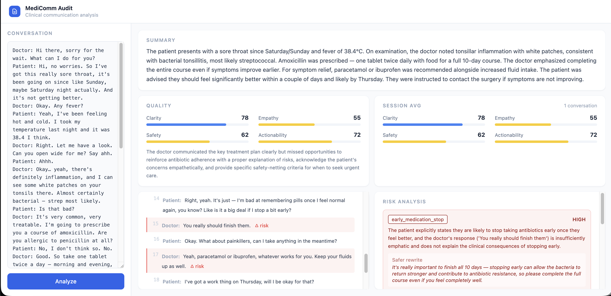

# Medicomm Audit

A lightweight tool that analyses doctor-patient conversation transcripts through
an AI pipeline, returning a structured report with a clinical summary, risk flags,
communication quality scores, and safer rewrite suggestions.



---

## Architecture

```
Browser (frontend/)
    │
    │  POST /analyze
    ▼
FastAPI (app/main.py)
    │
    ├── summarizer.py      → Claude: extract clinical summary
    ├── risk_analyzer.py   → Claude: detect communication risks
    └── quality_scorer.py  → Claude: score clarity / empathy / safety / actionability
            │
            ▼
        FullReport (JSON)
            │
    GET /metrics ──→ aggregate scores across session
```

---

## Features

- **Clinical summary** — symptoms, diagnoses, medications, follow-up plan
- **Risk detection** — flags unclear instructions, dismissed symptoms, ambiguous
  advice, missing follow-up, and early medication stop signals
- **Quality scoring** — four dimensions scored 0–100 with written feedback
- **Conversation timeline** — numbered message view with risk highlights
- **Session metrics** — live aggregate scores across all analysed conversations
- **Observability** — per-stage metadata logs (model, token usage, risk counts)

---

## Setup

### Requirements

- Python 3.12+
- [uv](https://docs.astral.sh/uv/)
- An Anthropic API key

### Install

```bash
uv sync
```

### Configure

Create a `.env` file in the project root:

```
ANTHROPIC_API_KEY=your_key_here
```

### Run

```bash
uv run uvicorn app.main:app --reload
```

Open [http://localhost:8000](http://localhost:8000) in your browser.

---

## Observability

Each pipeline stage writes a JSON log to `logs/` after each analysis:

| File | Contents |
|------|----------|
| `logs/summary.json` | Model, token usage |
| `logs/risk.json` | Model, token usage, risk count, severities, risk types |
| `logs/quality.json` | Model, token usage, quality scores |

**Logs contain no PHI.** Conversation text, summaries, and AI-generated rewrites
are never written to disk. For production use, replace file logging with a
dedicated observability platform (e.g. Langfuse, Datadog) with appropriate access
controls and data retention policies.

---

## Environment Variables

| Variable | Required | Description |
|----------|----------|-------------|
| `ANTHROPIC_API_KEY` | Yes | Anthropic API key for Claude |
